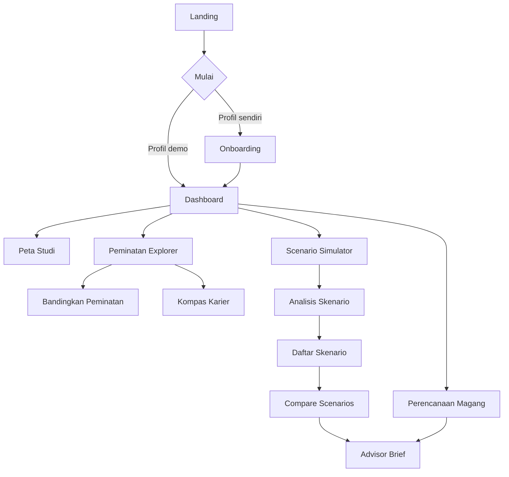
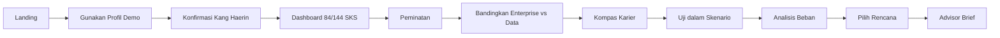

# Appflow dan Information Architecture — LINTAS

## 1. Sitemap

## 2. Navigasi

Desktop menggunakan sidebar tetap:

- Beranda
- Peta Studi
- Peminatan
- Simulasi
- Ringkasan PA

Aksi sekunder berada di menu profil: ubah profil, reset demo, tentang data.

Mobile menggunakan bottom navigation maksimal lima item. Halaman turunan memakai back button dan breadcrumb teks.

## 3. Flow profil demo

## 4. Flow eksplorasi mahasiswa awal

1. Buka Peminatan.
2. Pilih tab Arah Karier.
3. Pilih satu peran.
4. Baca kompetensi dan mata kuliah pendukung.
5. Simpan sebagai arah eksplorasi.
6. Jika mencoba mengunci jalur pada Semester 1–4, tampilkan penjelasan bahwa penguncian tersedia mulai Semester 5.

## 5. Flow pemilihan peminatan

1. Pilih dua jalur.
2. Buka mode perbandingan.
3. Tinjau fokus, mata kuliah, kompetensi, peran, Magang, dan portofolio.
4. Pilih `Uji dalam skenario`.
5. Setelah skenario valid, pilih `Kunci jalur`.
6. Tampilkan dialog konsekuensi.
7. Simpan jalur dan perbarui dashboard.

## 6. Flow simulator

1. Pilih semester target.
2. Tambahkan mata kuliah.
3. Tambahkan aktivitas mingguan.
4. Sistem menghitung total SKS dan batas.
5. Sistem memeriksa jalur, prasyarat, dan Magang.
6. Sistem menampilkan beban serta alasan.
7. Pengguna memperbaiki pelanggaran.
8. Simpan skenario.
9. Tawarkan membuat skenario pembanding.

## 7. Flow Magang

1. Pilih posisi Magang.
2. Lihat kompetensi dan mata kuliah pendukung.
3. Periksa minimal 120 SKS.
4. Periksa aturan nilai di atas C.
5. Lihat gap persiapan.
6. Tambahkan target portofolio.
7. Masukkan ke Advisor Brief.

## 8. Flow konsultasi

1. Pilih skenario utama.
2. Pilih target karier dan Magang.
3. Tinjau risiko serta asumsi demo.
4. Tambahkan pertanyaan untuk dosen PA.
5. Buka preview.
6. Cetak melalui browser.

## 9. Edge flows

### Melebihi batas SKS

Tampilkan alert di dekat total dan field terkait. Jelaskan angka batas. Tombol simpan dinonaktifkan sampai diperbaiki, tetapi pilihan tidak dihapus otomatis.

### Jalur bercampur

Tampilkan mata kuliah yang konflik dan dua tindakan: hapus mata kuliah konflik atau ubah jalur setelah konfirmasi.

### Prasyarat asumsi belum terpenuhi

Gunakan warning, bukan klaim administrasi. Tampilkan label `Asumsi demo` dan ajakan konfirmasi kepada prodi/dosen PA.

### Belum memenuhi Magang

Tampilkan progres menuju 120 SKS, aturan nilai, dan tindakan yang dapat disiapkan. Jangan menyatakan mahasiswa ditolak secara resmi.

### localStorage kosong/rusak

Gunakan default aman, tampilkan pemberitahuan, dan tawarkan memuat profil demo.

## 10. Route map

| Route | Halaman |
|---|---|
| `/` | Landing |
| `/onboarding` | Onboarding |
| `/app` | Dashboard |
| `/app/journey` | Academic Journey Map |
| `/app/specializations` | Peminatan Explorer |
| `/app/specializations/career` | Kompas Karier |
| `/app/scenarios/new` | Simulator |
| `/app/scenarios` | Daftar skenario |
| `/app/scenarios/compare` | Compare Scenarios |
| `/app/internship` | Perencanaan Magang |
| `/app/advisor-brief` | Advisor Brief |
| `/app/settings` | Profil dan reset data |
